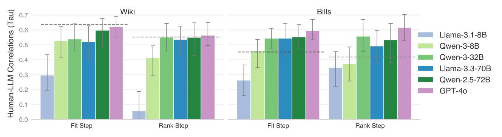
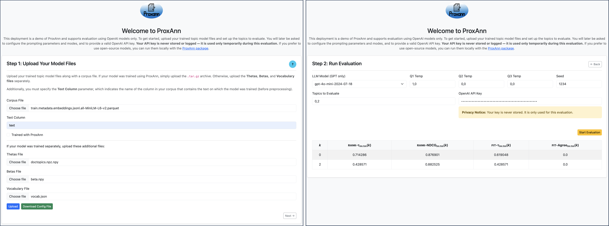

<!-- markdownlint-disable MD033 MD041 -->
<div align="center">
  
</div>
<!-- markdownlint-enable MD033 MD041 -->

This repository contains the code and data for reproducing experiments from our paper, *ProxAnn: Use-Oriented Evaluations of Topic Models and Document Clustering.*

- [**Features**](#features)
- [**Installation**](#installation)
  - [Steps for deployment with uv](#steps-for-deployment-with-uv)
- [**Configuration**](#configuration)
  - [1. LLMs](#1-llms)
    - [GPT Models (OpenAI)](#gpt-models-openai)
    - [Open-Source Models (via vLLM)](#open-source-models-via-vllm)
  - [2. Topics Models](#2-topics-models)
- [**Getting Started**](#getting-started)
  - [**Choosing the Right LLM for ProxAnn Metrics**](#choosing-the-right-llm-for-proxann-metrics)
    - [**Alternative Annotator Test**](#alternative-annotator-test)
    - [**Relationship between automated and human topic rankings**](#relationship-between-automated-and-human-topic-rankings)
  - [**Preparing Topic Models for ProxAnn**](#preparing-topic-models-for-proxann)
  - [**Generating User Study Input**](#generating-user-study-input)
    - [**Configuration Files**](#configuration-files)
    - [**Generating JSON Files**](#generating-json-files)
  - [**Evaluating Topic Models with ProxAnn Metrics**](#evaluating-topic-models-with-proxann-metrics)
    - [1. Initialize the ProxAnn object](#1-initialize-the-proxann-object)
    - [2. Generate the user study JSON](#2-generate-the-user-study-json)
    - [3. Run the ProxAnn evaluation](#3-run-the-proxann-evaluation)
    - [Running ProxAnn via Web Service](#running-proxann-via-web-service)
  - [**Running LLMs Independently (Prompter)**](#running-llms-independently-prompter)
    - [1. Initialize the `Prompter`](#1-initialize-the-prompter)
    - [2. Make a Prompt Call](#2-make-a-prompt-call)
  - [**Human Annotations**](#human-annotations)
  - [**LLM Annotations**](#llm-annotations)
    - [Required Parameters](#required-parameters)
    - [Optional Parameters](#optional-parameters)
  - [**Reproducing Results from the Paper**](#reproducing-results-from-the-paper)
    - [Required Files and Directory Structure](#required-files-and-directory-structure)

## **Features**

1. **User Study Data Generation**:
   - Use the `proxann.data_formatter` module to generate the JSON files containing the required topic model information to carry out the evaluation (or user study).
2. **Proxy-Based Evaluation**:
   - Perform LLM proxy evaluations using the `proxann.llm_annotations` module.
3. **Topic Model Training**:
   - Train topic and clustering models (currently, LDA-Mallet, LDA-Tomotopy, and BERTopic) under a unified structure using the `proxann.topic_models.train` module.

## **Installation**

We recommend **uv** for installing the necessary dependencies.

### Steps for deployment with uv

1. Install uv by following the [official guide](https://docs.astral.sh/uv/getting-started/installation/)

2. Create a local environment (it will use the python version specified in pyproject.toml)

  ```bash
  uv venv
  ```

3. Install dependencies

  ```bash
  uv pip install -e .
  ```

3. Run scripts in this repository with either `uv run <bash script>.sh` or `uv run python <python script>.py`. You can also first run `source .venv/bin/activate` to avoid the need for `uv run`.

## **Configuration**

### 1. LLMs

#### GPT Models (OpenAI)

To use GPT models via the OpenAI API, create a `.env` file in the root directory with the following content:

```bash
OPENAI_API_KEY=[your_open_ai_api_key]
```

You can also modify the path to the ``.env`` file in the [configuration file](config/config.yaml).

#### Open-Source Models (via vLLM)

We rely on [vLLM models](https://docs.vllm.ai/en/latest/serving/openai_compatible_server.html?ref=blog.mozilla.ai) for evaluating with open-source large language models. You must have the model running and specify the endpoint where it is deployed in the [configuration file](config/config.yaml).

### 2. Topics Models

The `src.train` module supports multiple topic modeling backends. No extra setup is required for most of them.

**Only if you're using LDA-Mallet**, follow these steps:

1. Download the [latest release of Mallet](https://github.com/mimno/Mallet/releases).
2. Place the contents in the `src/train` directory.
3. Optionally, you can use the provided script to automate the download:

```bash
bash bash_scripts/wget_mallet.sh
```

## **Getting Started**

This section will guide you through the process of setting up and using ProxAnn, from choosing the right LLM to running your first metric.

### **Choosing the Right LLM for ProxAnn Metrics**

ProxAnn’s performance varies depending on the language model used. This section summarizes how different LLMs perform across tasks and datasets, helping you balance accuracy with computational cost.

> ⚠️ **Recommendation:** For best overall alignment with human judgments, **GPT-4o** and **Qwen 2.5–72B** perform the strongest across both Fit and Rank steps.  
> **Qwen 1.5–32B** is a solid cost-effective alternative.  
> Avoid **Llama 3.1–8B**, which consistently underperforms.

#### **Alternative Annotator Test**

This test estimates how often ProxAnn (with a given LLM) performs *as well as or better than* a random human annotator.
Metrics are **advantage probabilities**. Asterisks (`*`) and daggers (`†`) mark statistical significance: `*` indicates the LLM outperforms a random human annotator (p < 0.05, t-test); `†` shows significance under a Wilcoxon signed-rank test.

<div style="display: flex; justify-content: center; gap: 40px; flex-wrap: wrap;">

  <!-- Wiki Table -->
  <div>
    <h4 style="text-align: center;">Wiki</h4>
    <table border="1" cellpadding="6" cellspacing="0">
      <thead>
        <tr>
          <th>Model</th>
          <th>Doc ρ (Fit)</th>
          <th>Doc ρ (Rank)</th>
          <th>Topic ρ (Fit)</th>
          <th>Topic ρ (Rank)</th>
        </tr>
      </thead>
      <tbody>
        <tr><td>GPT-4o</td><td>0.56<sup>*†</sup></td><td>0.68<sup>*†</sup></td><td>0.66<sup>†</sup></td><td>0.55<sup>†</sup></td></tr>
        <tr><td>Llama 3.1 8B</td><td>0.22</td><td>0.36</td><td>0.05</td><td>0.11</td></tr>
        <tr><td>Llama 3.1 70B</td><td>0.57<sup>*†</sup></td><td>0.67<sup>*†</sup></td><td>0.58<sup>†</sup></td><td>0.50<sup>†</sup></td></tr>
        <tr><td>Qwen 1.5 8B</td><td>0.56<sup>*†</sup></td><td>0.58<sup>†</sup></td><td>0.46</td><td>0.39</td></tr>
        <tr><td>Qwen 1.5 32B</td><td>0.55<sup>*†</sup></td><td>0.63<sup>†</sup></td><td>0.47</td><td>0.42</td></tr>
        <tr><td>Qwen 2.5 72B</td><td>0.52<sup>†</sup></td><td>0.68<sup>*†</sup></td><td>0.66<sup>†</sup></td><td>0.46</td></tr>
      </tbody>
    </table>
  </div>

  <!-- Bills Table -->
  <div>
    <h4 style="text-align: center;">Bills</h4>
    <table border="1" cellpadding="6" cellspacing="0">
      <thead>
        <tr>
          <th>Model</th>
          <th>Doc ρ (Fit)</th>
          <th>Doc ρ (Rank)</th>
          <th>Topic ρ (Fit)</th>
          <th>Topic ρ (Rank)</th>
        </tr>
      </thead>
      <tbody>
        <tr><td>GPT-4o</td><td>0.65<sup>*†</sup></td><td>0.71<sup>*†</sup></td><td>0.77<sup>*†</sup></td><td>0.75<sup>*†</sup></td></tr>
        <tr><td>Llama 3.1 8B</td><td>0.30</td><td>0.53<sup>†</sup></td><td>0.14</td><td>0.44</td></tr>
        <tr><td>Llama 3.1 70B</td><td>0.66<sup>*†</sup></td><td>0.67<sup>*†</sup></td><td>0.70<sup>*†</sup></td><td>0.60<sup>†</sup></td></tr>
        <tr><td>Qwen 1.5 8B</td><td>0.66<sup>*†</sup></td><td>0.57<sup>†</sup></td><td>0.80<sup>*†</sup></td><td>0.43</td></tr>
        <tr><td>Qwen 1.5 32B</td><td>0.67<sup>*†</sup></td><td>0.68<sup>*†</sup></td><td>0.74<sup>*†</sup></td><td>0.70<sup>*†</sup></td></tr>
        <tr><td>Qwen 2.5 72B</td><td>0.61<sup>*†</sup></td><td>0.71<sup>*†</sup></td><td>0.78<sup>*†</sup></td><td>0.65<sup>†</sup></td></tr>
      </tbody>
    </table>
  </div>

</div>

#### **Relationship between automated and human topic rankings**

The plot and table below show how well ProxAnn’s topic rankings align with human judgments, using Kendall’s τ as the correlation metric. The *Human* row reflects inter-annotator agreement, and NPMI provides a traditional baseline.

<div align="center">
  
</div>

<br>

<div align="center">
  <table border="1" cellpadding="6" cellspacing="0">
    <thead>
      <tr>
        <th>Metric / Model</th>
        <th>Wiki (Fit)</th>
        <th>Bills (Fit)</th>
        <th>Wiki (Rank)</th>
        <th>Bills (Rank)</th>
      </tr>
    </thead>
    <tbody>
      <tr><td>NPMI</td><td>-0.15 (0.14)</td><td>0.01 (0.10)</td><td>-0.18 (0.10)</td><td>-0.02 (0.12)</td></tr>
      <tr><td><strong>GPT-4o</strong></td><td>0.22 (0.13)</td><td>0.31 (0.13)</td><td>0.27 (0.14)</td><td>0.29 (0.11)</td></tr>
      <tr><td><strong>Llama 3.1 8B</strong></td><td>0.19 (0.18)</td><td>0.16 (0.18)</td><td>-0.35 (0.14)</td><td>0.15 (0.14)</td></tr>
      <tr><td><strong>Qwen 1.5 8B</strong></td><td>0.35 (0.16)</td><td>0.12 (0.16)</td><td>0.33 (0.16)</td><td>0.28 (0.13)</td></tr>
      <tr><td><strong>Qwen 1.5 32B</strong></td><td>0.20 (0.18)</td><td><strong>0.34 (0.11)</strong></td><td><strong>0.51 (0.11)</strong></td><td><strong>0.30 (0.13)</strong></td></tr>
      <tr><td><strong>Llama 3.1 70B</strong></td><td>0.41 (0.14)</td><td>0.26 (0.15)</td><td>0.36 (0.13)</td><td>0.19 (0.13)</td></tr>
      <tr><td><strong>Qwen 2.5 72B</strong></td><td><strong>0.48 (0.13)</strong></td><td>0.22 (0.17)</td><td>0.36 (0.12)</td><td>0.21 (0.15)</td></tr>
      <tr><td><em>Human (HTM)</em></td><td>0.41 (0.09)</td><td>0.09 (0.14)</td><td>0.34 (0.09)</td><td>0.18 (0.12)</td></tr>
    </tbody>
  </table>
</div>

---

### **Preparing Topic Models for ProxAnn**

ProxAnn expects output from *traditional topic models*, where each document is represented by a topic distribution ($\theta_d$) and each topic by a word distribution ($\beta_k$). Outputs from *document clustering* can also be used by mapping cluster assignments to $\theta_d$ and generating topic labels (approximating $\beta_k$) via word selection or language model summaries.

To be used with ProxAnn, models must be saved as NumPy arrays (`.npy` or `.npz`), along with:

- A JSON file containing the model vocabulary (i.e., the words indexing the columns in $\beta_k$).
- A plain-text corpus file (one document per line).

Here, you can download examples files that meet these requirements.

Alternatively, you can train topic models directly using ProxAnn's training module. In that case, only the corpus is required. See [`bash_scripts/train_models.sh`](bash_scripts/train_models.sh) for an example of how to invoke [`src/train/tm_trainer.py`](src/train/tm_trainer.py).

---

### **Generating User Study Input**

ProxAnn creates a JSON file that serves as input for both human and LLM-based evaluations. This file contains:

- Top words for each topic (`topic_words`)
- Representative documents (`exemplar_docs`) using various selection methods (`thetas`, `thetas_sample`, `sall`, etc.)
- Evaluation documents with topic assignment probabilities (`eval_docs`)
- A distractor document for each topic

**Example structure:**

```json
{
  "<topic_id>": {
    "topic_words": ["word1", "word2", "word3"],
    "exemplar_docs": [
      {"doc_id": 1, "text": "...", "prob": 0.9},
      {"doc_id": 2, "text": "...", "prob": 0.8}
    ],
    "eval_docs": [
      {"doc_id": 3, "text": "...", "prob": 0.9, "assigned_to_k": 1},
      {"doc_id": 4, "text": "...", "prob": 0.8, "assigned_to_k": 1}
    ],
    "distractor_doc": {"doc_id": 100, "text": "..."}
  }
}
```

---

#### **Configuration Files**

To generate the above JSON files, you’ll need a YAML config file like those in [`config/user_study`](config/user_study). Each config should specify how to load model outputs depending on how the model was trained:

- If the model was **not trained with ProxAnn** (`trained_with_thetas_eval=False`), provide:

  - `thetas_path`: Document-topic matrix (docs × topics)
  - `betas_path`: Topic-word matrix (topics × vocab size)
  - `vocabulary_path`: Vocabulary file
  - `corpus_path`: Original documents (one per line)

- If the model **was trained using ProxAnn** (`trained_with_thetas_eval=True`), provide:

  - `model_path`: Path to the trained model
  - `corpus_path`: As above

- You can also specify `remove_topic_ids` to exclude topics from evaluation.

---

#### **Generating JSON Files**

To create the user study data files, run:

```python
python3 get_user_study_data.py --user_study_config <path_to_config_file>
```

You can see examples of generated JSONs in [`data/json_out`](data/json_out).

---

### **Evaluating Topic Models with ProxAnn Metrics**

To evaluate your topic model using ProxAnn:

#### 1. Initialize the ProxAnn object

```python
from proxann.llm_annotations.proxann import ProxAnn
proxann = ProxAnn()
```

#### 2. Generate the user study JSON

Use a user study configuration file (see examples in [`config/user_study`](config/user_study)) to produce the input JSON for evaluation:

```python
status, tm_model_data_path = proxann.generate_user_provided_json(path_user_study_config_file)
```

- If `status == 0`, the JSON was created successfully.
- Otherwise, an error occurred, and evaluation should be halted.

#### 3. Run the ProxAnn evaluation

```python
proxann.run_metric(
    tm_model_data_path.as_posix(),
    llm_models=["Qwen/Qwen3-8B"]
)
```

- `llm_models` is a list of LLMs to use for evaluation.
- These must be pre-defined in your [`config/config.yaml`](config/config.yaml), under the deployment section you're using (e.g., `vllm`, `openai`, etc.).

Example `config.yaml` snippet for a VLLM setup:

```yaml
llm:
  vllm:
    available_models:
      "Qwen/Qwen3-8B": ...
    host: http://localhost:8000/v1
```

See [`proxann_eval.py`](proxann_eval.py) for a minimal runnable example.

#### Running ProxAnn via Web Service

You can also run ProxAnn as a REST API server:

```bash
python3 -m proxann.llm_annotations.frontend.back
```

This launches a local web server that exposes ProxAnn’s evaluation pipeline via HTTP endpoints.

Alternatively, use the hosted instance at:
👉 [https://proxann.uc3m.es/](https://proxann.uc3m.es/)

<div align="center">
  
</div>

---

### **Running LLMs Independently (Prompter)**

ProxAnn uses a unified wrapper class, [`Prompter`](src/proxann/prompter.py), to standardize API calls across different LLM backends. It currently supports **OpenAI**, **VLLM**, and **Ollama**.

> ⚠️ Note: Only **OpenAI** and **VLLM** support logprobs, which are required for ProxAnn’s evaluation. Ollama is currently not compatible for this reason.

The `Prompter` class includes a **caching mechanism** that ensures repeated prompts return the same result without reissuing an API call, improving speed and efficiency during evaluation.

#### 1. Initialize the `Prompter`

```python
from proxann.proxann.prompter import Prompter

llm_model = "Qwen/Qwen3-8B"  # Must match a model defined in `available_models` for your deployment type (e.g., VLLM, OpenAI)
prompter = Prompter(model_type=llm_model)
```

You can also override configuration parameters such as `temperature`, `max_tokens`, etc., by passing them as keyword arguments. If not specified, defaults are taken from [`config/config.yaml`](config/config.yaml).

#### 2. Make a Prompt Call

```python
result, logprobs = prompter.prompt(system_prompt, question_prompt)
```

- `system_prompt` is optional and can be left as `None`.
- You may also override the `temperature` or other generation parameters at call time.

### **Human Annotations**

User responses were collected through Prolific using the `user_annotations/annotation_server.py` server. More details on this will be provided soon.

### **LLM Annotations**

To generate LLM-based annotations, run [`proxann_user_study.py`](proxann_user_study.py) (or the bash wrapper [`bash_scripts/run_proxann_multiple.sh`](bash_scripts/run_proxann_multiple.sh)) with the following parameters:

#### Required Parameters

- **`--model_type "$MODEL_TYPE"`**
  LLM(s) to be used for generating annotations. Multiple models can be specified, separated by commas. These must be defined in `available_models` under the chosen deployment section in [`config/config.yaml`](config/config.yaml).

- **`--tm_model_data_path "$TM_MODEL_DATA_PATH"`**
  Path to the JSON file containing model output, generated in the setup phase (e.g., using `get_user_study_data.py`).

- **`--dataset_key "$DATASET_KEY"`**
  Identifier for the dataset being evaluated (e.g., `Wiki`, `Bills`).

- **`--response_csv "$RESPONSE_CSV"`**
  Path to a CSV file containing human annotation responses (e.g., from Qualtrics).

- **`--path_save_results "$SAVE_PATH"`**
  Directory where generated annotations and results will be saved.

#### Optional Parameters

- **`--prompt_mode "$PROMPT_MODE"`** *(default: `q1_then_q3_mean,q1_then_q2_mean`)*
  Which evaluation steps to perform. Comma-separated list of options:

  - `q1_then_q2_mean`: Category Identification → Relevance Judgment
  - `q1_then_q3_mean`: Category Identification → Representativeness Ranking

- **`--config_path "$CONFIG_PATH"`** *(default: `src/proxann/config/config.yaml`)*
  Path to the main configuration YAML file.

- **`--running_mode "$MODE"`** *(default: `run`)*
  Mode of execution: `run` or `eval`.

- **`--removal_condition "$REMOVAL_CONDITION"`** *(default: `loose`)*
  Condition for disqualifying invalid responses:

  - `loose`: Exclude if **any** evaluation fails.
  - `strict`: Exclude only if **all** fail.

- **`--temperatures "$TEMP_LIST"`**
  Comma-separated temperatures for LLM generation in Q1/Q2/Q3 (e.g., `"0.7,0.3,0.5"`).

- **`--seed "$SEED"`**
  Integer seed for random number generation (for reproducibility).

- **`--max_tokens "$MAX_TOKENS"`**
  Maximum number of tokens allowed in LLM completions.

### **Reproducing Results from the Paper**

To reproduce the results from our paper using ProxAnn, ensure the following datasets, models, and configuration files are placed in the correct directories. These paths correspond to those expected by the script [`bash_scripts/run_proxann_multiple.sh`](bash_scripts/run_proxann_multiple.sh).

#### Required Files and Directory Structure

- **Datasets**
  Preprocessed Wiki and Bills datasets (15,000-term vocabulary) from Hoyle et al. (2022).

  Download: [🔗](https://drive.google.com/file/d/1qdH0rI5m24vexaF0lzo_KZQEsVD5qMQJ/view?usp=drive_link)

  Save to: `data/training_data/`

- **Trained Topic Models**
  Includes LDA-Mallet and CTM models from Hoyle et al., and BERTopic models trained using `proxann.topic_models.train.BERTopicTrainer`.

  Download: [🔗](https://drive.google.com/file/d/18TMTOoq9qwlWZtB3CSpRfv-5TaC1VzC7/view?usp=drive_link)

  Save to: `data/models/`

- **User Study Configuration Files**
  Configuration files for sampling 8 topics per model per dataset.

  Available in: `data/user_study/`

- **User Study JSON Files**
  Generated using `get_user_study_data.py`.

  Save to: `data/json_out/`

  Expected files:

  - `data/json_out/config_wiki_part1.json`
  - `data/json_out/config_wiki_part2.json`
  - `data/json_out/config_bills_part1.json`
  - `data/json_out/config_bills_part2.json`

- **Human Annotations**
  Collected via Qualtrics, matching the user study JSON files.
  Save to:

  - `data/human_annotations/Cluster+Evaluation+-+Sort+and+Rank_December+12,+2024_05.19.csv`
  - `data/human_annotations/Cluster+Evaluation+-+Sort+and+Rank+-+Bills_December+14,+2024_13.20.csv`

- **LLM Annotations**
  LLM outputs for all models evaluated in the paper.

  Save to: `data/llm_out/`

- **Coherence Scores**
  Topic coherence evaluation metrics.

  Save to: `data/cohrs/`

Once the files are in place, you can run:

```bash
bash bash_scripts/run_proxann_multiple.sh
```

To ensure full reproducibility, use the same random seeds that appear in the filenames of our saved evaluation outputs. For example, in the file:

```
data/llm_out/mean/wiki/Qwen2.5-72B-Instruct-AWQ/q1_then_q3_mean,q1_then_q2_mean_temp1.0_0.0_0.0_seed174_20250529_1352
```

the seed used is `174`.

Once you have both the LLM-generated and human annotations in place, you can reproduce all tables and figures from the paper using the notebooks and scripts provided in [`evaluation_scripts`](evaluation_scripts).
